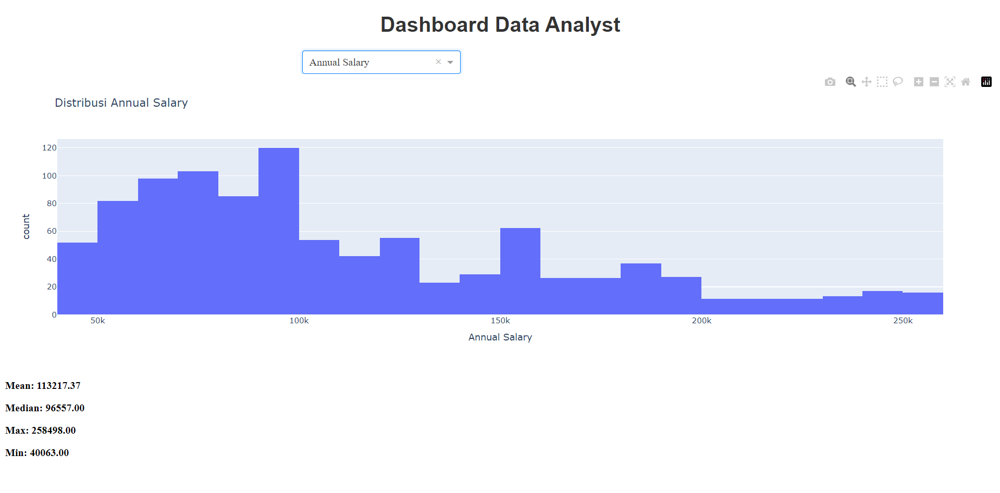
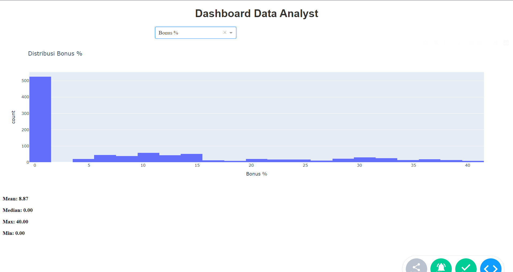
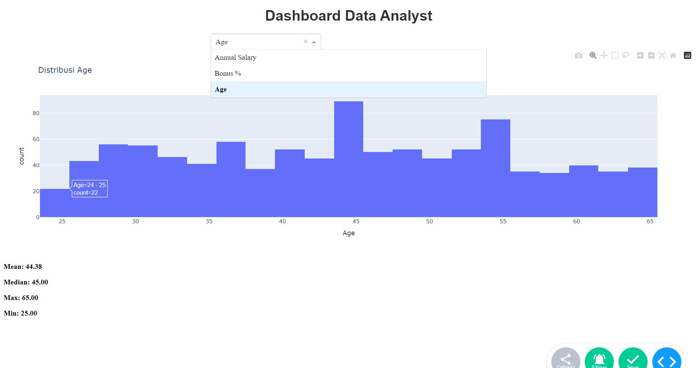

# Simple-Data-Dashboard
Membuat simpel penampil data menggunakan python

# Dashboard Admin untuk Data Analyst

Dashboard ini dirancang untuk menampilkan data dan statistik penting bagi data analyst.

## Cara Instalasi

1. Clone repository ini.
2. Install dependensi dengan perintah:
   ```bash
   pip install -r requirements.txt


## Hasil Tampilan Data 1


## Hasil Tampilan Data 2


## Hasil Tampilan Data 3

